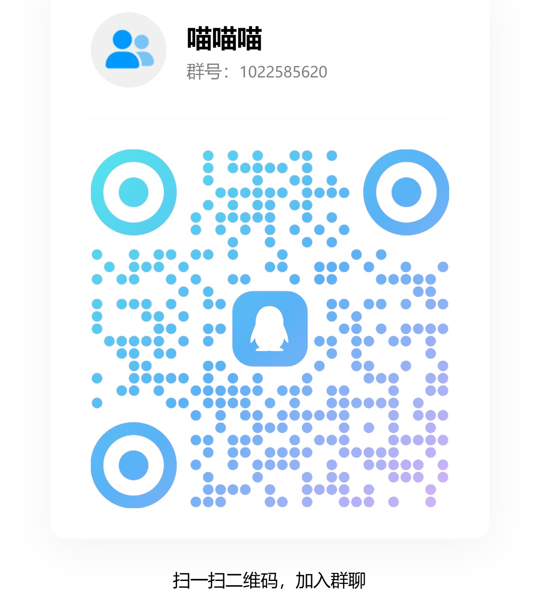

# SwitchBOX

## 本项目的目的 / Project Goal

让 `Nintendo Switch` 像机顶盒一样使用，当前聚焦两类核心能力。  
SwitchBOX turns `Nintendo Switch` into a set-top-box-style media app, focused on two core capabilities today.

- 播放 `SMB` 共享中的视频文件。  
  Play video files from `SMB` shares.
- 播放 `IPTV` 播放列表中的频道与节目。  
  Play channels and programs from `IPTV` playlists.

注意 / Notes:

- 建议在 `Atmosphere emuMMC / 虚拟系统` 环境中使用，当前开发与验证都围绕该场景进行。  
  Use it in an `Atmosphere emuMMC / virtual system` environment; current development and validation are centered on that setup.
- 如遇问题，可在 issue 反馈，也可以加 QQ 群：`1022585620` 找群主。  
  If you run into issues, open an issue or join the QQ group: `1022585620`.

## 参考项目 & 感谢 / References & Thanks

IPTV 方向参考 / IPTV reference:

- `TsVitch`
- https://github.com/giovannimirulla/TsVitch

SMB、本地媒体与流式播放参考 / SMB, local media, and streaming playback reference:

- `nxmp`
- https://github.com/proconsule/nxmp

UI 框架 / UI framework:

- `Borealis`
- https://github.com/natinusala/borealis

## 软件操作说明 / Operation Guide

本章节说明当前版本可直接使用的主要操作，重点覆盖播放器交互。  
This section describes the main controls available in the current version, with emphasis on player interaction.

### 主页 / Home

- 左右切换卡片，`A` 进入当前卡片。  
  Move left or right between cards, and press `A` to enter the current card.
- 开启触控后，也可以直接点击主页卡片进入。  
  When touch is enabled, you can also tap a Home card directly.
- `+` 打开设置页。  
  Press `+` to open Settings.
- `B` 请求退出软件，会弹出确认框。  
  Press `B` to request app exit with a confirmation dialog.

### 设置页 / Settings

- 左侧切换页面，右侧编辑当前页面内容。  
  Use the left side to switch pages and the right side to edit the current page.
- `A` 进入字段、打开下拉或触发当前条目。  
  `A`: enter a field, open a dropdown, or trigger the current entry.
- `+` 保存当前修改并返回主页。  
  `+`: save current changes and return to Home.
- `B` 退出设置；如果有未保存修改，会弹出“取消 / 确定”确认框，默认焦点在“取消”。  
  `B`: leave Settings; if there are unsaved changes, a `Cancel / Confirm` dialog appears with default focus on `Cancel`.
- 基础设置中可直接控制语言、触控、播放器手势、硬件解码、退出时是否返回主屏幕等通用行为。  
  General settings directly control language, touch input, player gestures, hardware decoding, whether app exit returns to Home, and other common behaviors.
- 在 `IPTV / SMB` 源列表中，`Y` 可快速切换当前源是否显示在主页。  
  In `IPTV / SMB` source lists, `Y` quickly toggles whether the current source is shown on Home.
- 在 `IPTV / SMB` 源列表中，`X` 删除当前源，并弹出确认框。  
  In `IPTV / SMB` source lists, `X` deletes the current source with confirmation.

### SMB 浏览页 / SMB Browser

- `A` 进入文件夹或播放当前文件。  
  `A`: enter a folder or play the current file.
- `B` 返回上一级，或退出当前 SMB 浏览页。  
  `B`: go to the parent directory, or leave the current SMB browser.
- `X` 删除当前焦点条目，并弹出确认框。  
  `X`: delete the focused item with confirmation.
- `Y` 直接返回主页。  
  `Y`: return directly to Home.

### IPTV 浏览页 / IPTV Browser

- 左侧为分组列表，右侧为当前分组下的频道列表。  
  The left pane shows groups, and the right pane shows channels in the current group.
- 默认焦点在“收藏”分组。  
  Default focus starts on the `Favorites` group.
- 左右在分组区和频道区之间切换，上下在当前区域内移动焦点。  
  Left and right switch between group and channel panes; up and down move within the current pane.
- `A` 选中分组，或播放当前频道。  
  `A`: select a group, or play the current channel.
- `X` 收藏或取消收藏当前频道。  
  `X`: favorite or unfavorite the current channel.
- `B` 或 `Y` 返回主页；如果列表已经加载完成，会弹出确认框，默认焦点在“取消”。  
  `B` or `Y`: return to Home; once the playlist has loaded, a confirmation dialog appears with default focus on `Cancel`.

### 播放器 / Player

基础操作 / Basic controls:

- `A`：播放 / 暂停。  
  `A`: play / pause.
- `B`：退出播放器，回到来源页面。  
  `B`: exit the player and return to the source page.
- `X`：仅对 `SMB` 文件有效；确认后先退出播放器，再删除文件并返回列表。  
  `X`: only valid for `SMB` files; after confirmation, exit the player, delete the file, and return to the list.
- `上 / 下`：调整音量。  
  `Up / Down`: adjust volume.

跳转与倍速 / Seeking and speed:

- `L`：短退。  
  `L`: short backward seek.
- `R`：短进。  
  `R`: short forward seek.
- `ZL`：长退。  
  `ZL`: long backward seek.
- `ZR`：长进。  
  `ZR`: long forward seek.
- `Y`：点按切换倍速开 / 关；长按临时倍速；若点按倍速已开启，再长按会按“相加”方式再叠加一次同值倍速。  
  `Y`: tap to toggle speed mode; hold for temporary speed-up; if sticky speed is already on, holding `Y` adds one more same-speed step additively.
- `R + 左/右`：连续短退 / 连续短进。  
  `R + Left/Right`: continuous short backward / forward seek.
- `ZR + 左/右`：连续长退 / 连续长进。  
  `ZR + Left/Right`: continuous long backward / forward seek.

浮窗与面板 / Overlays and panels:

- `十字键左 / 左摇杆左 / 右摇杆左`：打开或关闭左侧列表浮窗。  
  `D-Pad Left / Left Stick Left / Right Stick Left`: open or close the left-side list overlay.
- `+`：打开或关闭底部进度控制面板。  
  `+`: open or close the bottom progress control panel.
- 底部面板当前支持旋转、长短跳转、播放暂停、音轨、字幕、音量与传输速率显示。  
  The bottom panel currently supports rotation, long/short seek, play/pause, audio track, subtitle, volume, and transfer-speed display.

触控操作 / Touch controls:

- 前提：设置中启用 `触控`，并按需启用 `播放器手势`。  
  Prerequisite: enable `Touch Controls`, and enable `Player Gestures` when needed.
- 双击屏幕：暂停当前播放。  
  Double-tap the screen: pause current playback.
- 横向滑动：按比例快进 / 快退，并自动打开底部进度面板。  
  Horizontal swipe: proportional seek and automatically open the bottom panel.
- 纵向滑动：调整音量。  
  Vertical swipe: adjust volume.
- 点击进度条：直接定位播放进度。  
  Tap the progress bar: jump to the target position.
- 暂停时点击屏幕中央图标：恢复播放。  
  When paused, tap the center icon on screen to resume playback.

## 捐赠 & 打赏 / Donation

如果这个项目对你有帮助，并且你愿意支持后续开发，可以考虑打赏，感谢。  
If this project helps you and you want to support future development, donations are appreciated.

PayPal: `star_ujn@qq.com`

## 未来计划支持 / Planned Support

- `WebDAV`
- `FTP`
- 更多 IPTV 源兼容性与稳定性优化。  
  More IPTV source compatibility and stability improvements.
